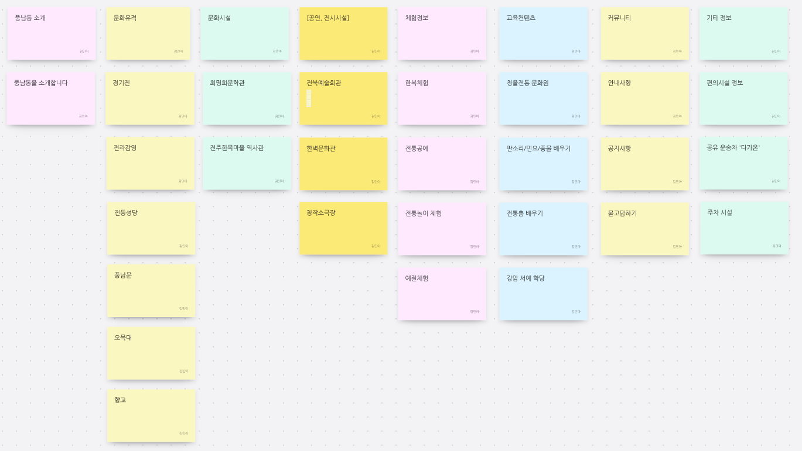
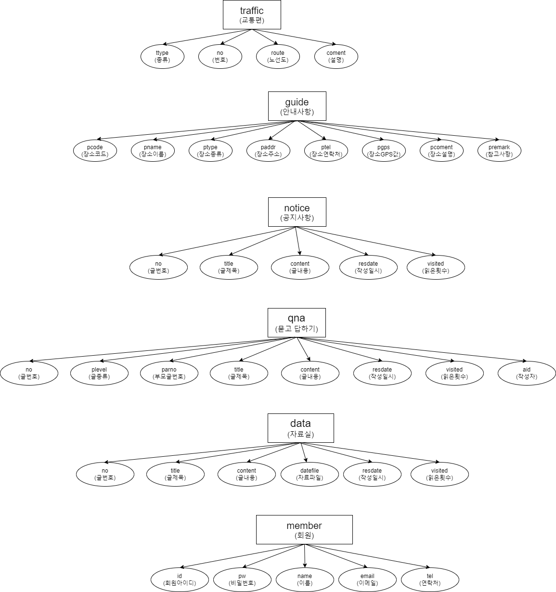
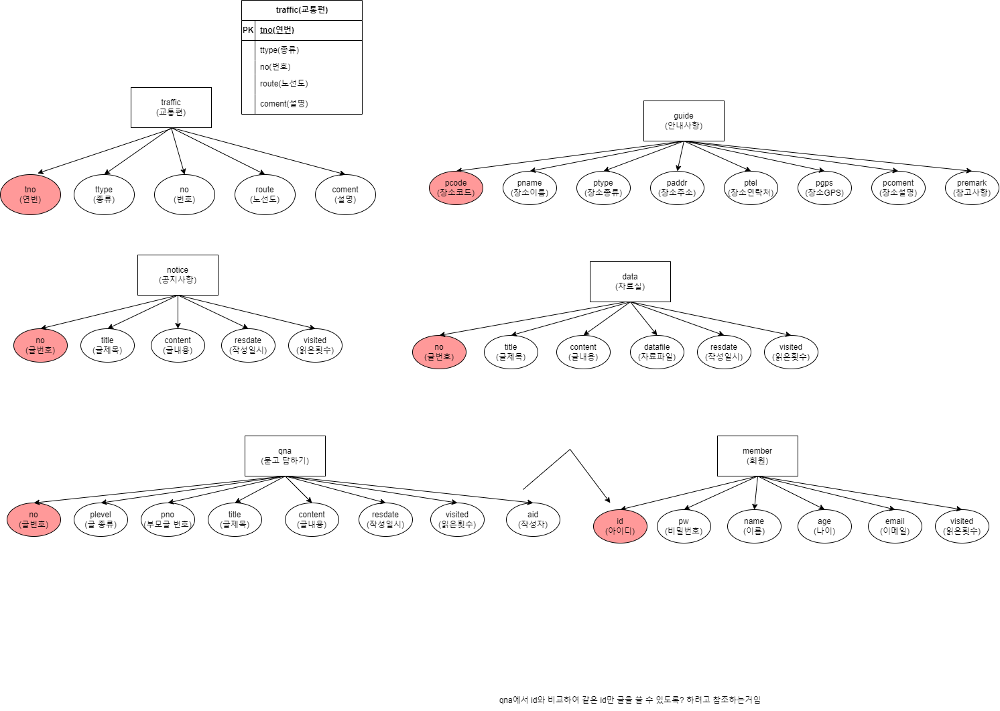
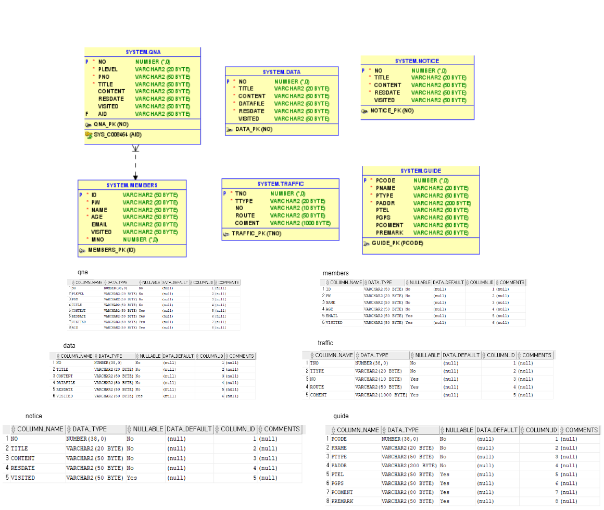

# 프로젝트 개발 보고서 
---------------------------------------------
## 1. Project Outline(프로젝트 개요)

    서울 어쩌고 저쩌고 박스 쳐짐

  

## 2. Project Purpose(프로젝트 목적)

    프로젝트 목적을 어쩌고 저쩌고

  

## 3. Project Dvelopement Infomation(프로젝트 개발환경 정보)

    - Project Topic : Gasan-dong Intro Web Application
    - Develope Environment : Open JDK 11
    - Language : Java 11
    - Web Module : Jsp/Servlet 3.0
    - Process Pattern : MVC Pattern
    - Database System(DBMS) : Oracle 21C XE
    - Database Design : SQL Developer 23.1.1
    - Entity Relationship Design : draw.io 20.8.16
    - Java Database Connector : ojdbc11
    - Application Design : Object aid 1.2.4
    - Back Template Language : Java/Servlet 11
    - Front Template Language : Jsp(JSTL/EL) 3.0/HTML5/CSS3/Javascript ES5
    - Web (Application) Server : Tomcat 9.0
    - Package Information

  

## 4. Project planning & Design (프로젝트 기획 및 설계)

## 4-1. 네비게이션 설계
| 풍남동 소개      | 문화 유적 | 문화시설   | 공연, 전시시설 | 체험 정보 | 교육 컨텐츠 |    커뮤니티   | 기타 정보 |
|-----------------|--------------|------------|---------------|-----------|------------|------------|------------|
|풍남동을 소개합니다| 경기전 | 강암서예관     | 전북예술회관 | 한복체험   | 청을전통문화원 | 안내사항      | 편의시설 정보 |
| &nbsp;          | 전동성당| 최명희문학관   | 한벽문화관 | 전통공예    | 판소리/민요/풍물 배우기 | 공지사항 | 공유 운송차 '다가온' |
| &nbsp;          | 풍남문 |전주한옥마을역사관| 창작소극장 | 전통놀이 체험 | 전통춤 배우기 | 묻고답하기     |주차 및 셔틀버스 |
| &nbsp;          | 오목대 |   &nbsp;     |  &nbsp;       | &nbsp;    | &nbsp;            | &nbsp; |       &nbsp; |
| &nbsp;          | 향교  |    &nbsp;     | &nbsp;       | &nbsp;     | &nbsp;            | &nbsp; |       &nbsp; |

## 4-1-1. 자료수집

## 4-1-2. 콘텐츠 분류

## 4-1-3. 서비스 흐름 설계
집가서 함

## 4-1-4. 서비스 시나리오

## 4-2. 데이터베이스 설계
## 4-2-1. 개념적 설계

## 4-2-2. 논리적 설계

## 4-2-2. 물리적 설계
